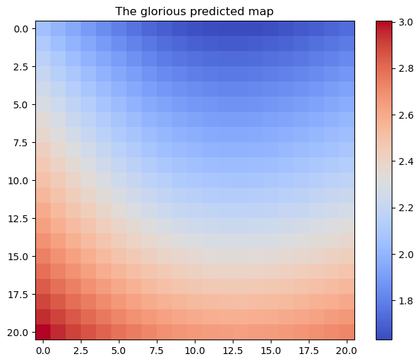

# Final Task - Explore and Exploit 2D Environment

---

### Exploration Strategy

Explore the environment just enough to learn the pattern and determine the area with the wealthiest tiles.

Initial considerations:
* The environment is partially observable, static, and discrete from the agent's perspective.
* The number of explorations is limited to 200.
* An area with the wealthiest tiles could be located in any region on the 201x201 grid.
* Highly complex polynomial patterns likely have their extremes near the zero coordinates.
* Less complex patterns could be identified with fewer explorations per region.

#### Exploration strategy statement
**Use scripted grid point map explorations in two different levels to identify highly complex patterns near the centre (zero coordinate crossing) and less complex patterns at the outskirts of the map.**

1. The first exploratory grid map applied is a sparse 9x9 point map that shapes squares with a side length of 25 (Figure. Greens). It provides general insight into the map (-100; 100).

2. The second exploratory grid map applied is a short—high-precision 11x11 point map that shapes squares with a side length of 1 (Figure. Blues). It helps to gain critical information in the central area near the axis crossing (-10; 10).

Combined, these three grid maps spend just about ~190-200 explorations.

 

### Machine Learning Strategy

Learn the environment to find the wealthiest areas and their depreciation boundaries.

Initial considerations:
* An exploration step can only reveal 0.5% of all points.
* An agent cannot discover the point value before it moves.
* An intelligent agent should have a pre-deployed trajectory where it should go next.
* An intelligent agent should be deployed in the wealthiest area.

#### Machine learning strategy statement
**Predict the value of each point before the agent is deployed to the wealthiest point. In the partially observable scenario, the agent selects the next point as it moves, preferring potentially higher value points and avoiding the block.**

The linear regression should learn a linear pattern. The linear environment is deterministic, so it can be rationally exploited with the highest possible reward. A linear regression can accurately predict each point by learning just a few. The path of the intelligent agent can be pre-calculated to gather the highest prize.
The radial basis function kernel should learn non-linear patterns. With increasing complexity, polynomial function kernels spend more time fitting. However, the exploration, learning, and execution should take at most 5 minutes per each task. The RBF state vector machine algorithm can rapidly approximate the wealthiest areas of the map with just enough precision to collect nearly the highest prize. Based on the estimated peak location, the agent can be deployed in a wealthy area with a high chance of guessing the optimal path to continue.

Linear regression lead procedure:
1. Fit the linear regression model.
2. Prove the environment's linearity.
3. Calculate each point value.
4. Find the group of the top 10 wealthiest points.
5. Build a Hamiltonian path between them.

RBF kernel lead procedure:
1. Replace z-values, which have absolute values higher than the positive z-value maximum, with the negative z-value minimum, equal to the minus positive z-value maximum. In other words, z_min = -z_max.
2. Tune the RBF model hyperparameters, finding the lowest root mean square error.
3. Re-fit the RBF model using the most optimal hyperparameters.
4. Make predictions over the whole 201x201 grid.
5. Find the top 1 wealthiest point.

 

### Execution Strategy

Use what is learned to collect as much value as possible.

Initial considerations:
* Ten moves limit an exploration step.
* An agent cannot step on points it stepped before.
* An agent can be blocked if it creates a 3x3 square and puts the ninth step into the centre. Also, getting stuck on the map's border is even easier.

#### Execution strategy statement
**Abuse the determinism of the linear pattern and follow the computed path. Trust the RBF kernel predictions, navigating to the next point favouring higher predicted rewards but avoiding dead ends.**

---

## Results

 

### Final Task 22000 (API #1)

* **Circularly expanding pattern. SUM: 147,427 (expected 34,413).**

### Final Task 22001 (API #2)

* **Polinomial pattern. SUM: 32,333 (expected 31,445).**

### Final Task 22002 (API #3)

* **Noisy linear pattern. SUM: 91 (expected 86).**

The function is similar to: -0.00x + -0.05y + 3.30.

